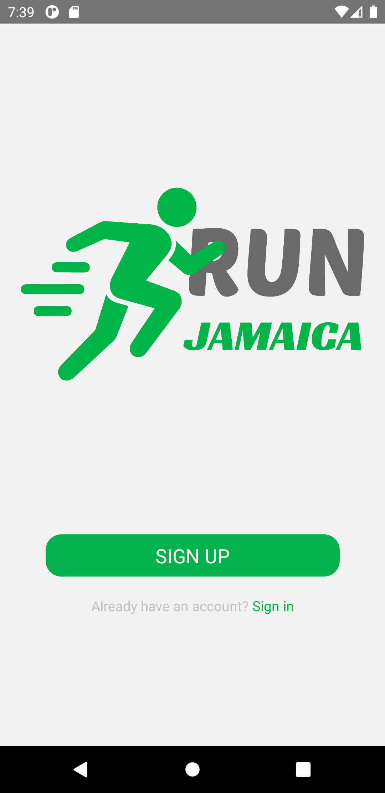
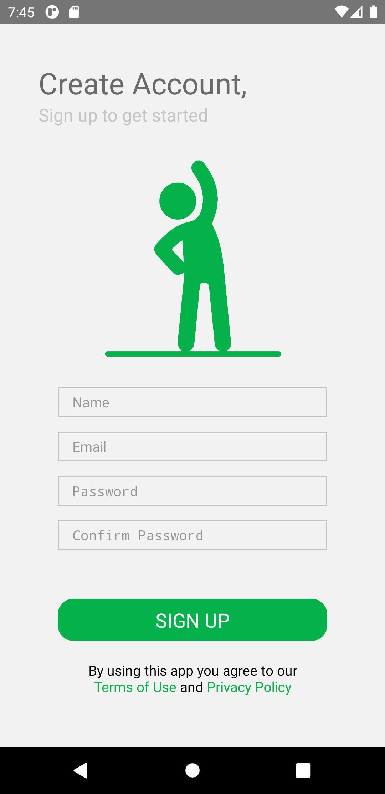
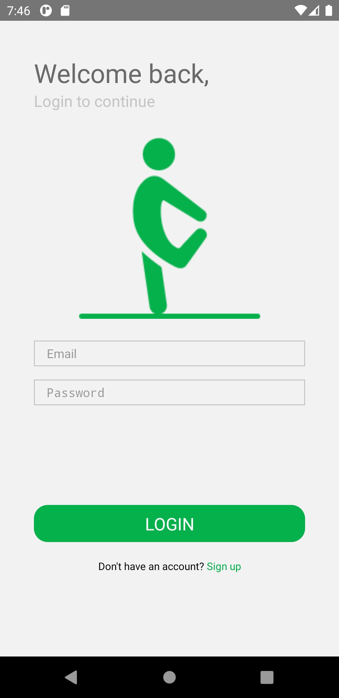

<h1>Run Jamaica Mobile</h1>

Mobile application for organizing and operating virtual running events. See also [Run Jamaica API](https://github.com/smithtal/RunJamaicaAPI).

## Screens

### Splash

### Sign Up

### Sign In

Note the application requires a running instance of [Run Jamaica API](https://github.com/smithtal/RunJamaicaAPI).

## Running on Android

The application is written using React Native. To run ensure you have Android Studio and an appropriate Android Device/Emulator available and run the following

<ol>
    <li>Install dependencies with <code>npm install</code></li>
    <li>Start Metro Bundler with <code>npm start</code></li>
    <li>Run application with <code>npm run android</code></li>
</ol>

## Running on iOS

The application has not been tested on iOS!

## Configuration

Application configuration is set in the file `.env` before running the application.

Configuration Values:

<ul>
    <li><code>API_URL</code>: URL for a running instance of <a href="https://github.com/smithtal/RunJamaicaAPI">Run Jamaica API</a>.</li>
</ul>
